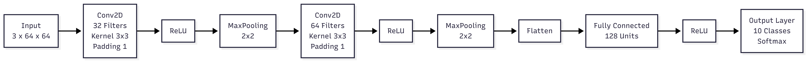
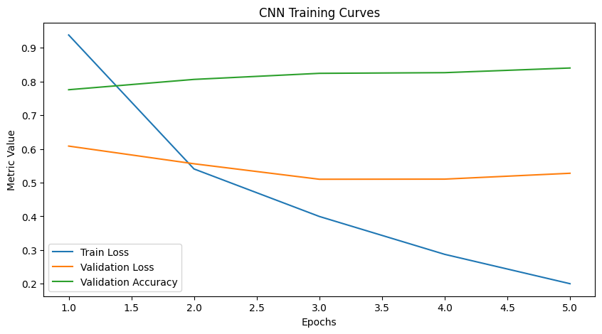

# Exploring Convolutional Layers Through Data and Experiments

---

## 1. Problem Description

This project analyzes convolutional neural networks (CNNs) as architectural mechanisms that introduce inductive bias into learning systems. Rather than treating neural networks as black-box models, this work focuses on how architectural decisions influence learning efficiency, generalization, and computational cost.

Using the EuroSAT satellite image dataset, two models are compared:

* A non-convolutional baseline (fully connected architecture)
* A convolutional neural network designed from scratch

The objective is not hyperparameter tuning, but architectural reasoning. The central question of this project is:

**How does the inductive bias introduced by convolutional layers affect learning behavior compared to a dense architecture?**

---

## 2. Dataset Description

### EuroSAT Dataset

EuroSAT is a land-use and land-cover classification dataset composed of RGB satellite images captured by the Sentinel-2 satellite.

### Key Characteristics

* Image-based dataset (3-channel RGB)
* Fixed spatial resolution (64×64)
* 10 land-use classes
* Balanced class distribution
* Suitable size for local experimentation

Satellite imagery exhibits strong spatial patterns such as textures, edges, and repetitive structures. These properties make the dataset particularly appropriate for convolutional neural networks, which assume local spatial correlations.

### Sample Images

Visual inspection confirms that classes differ primarily through spatial configurations and texture patterns rather than isolated pixel values. This reinforces the suitability of convolutional inductive bias.

---

## 3. Architecture Diagrams (Simple)

### Baseline Model (Non-Convolutional)

The baseline architecture consists of:

* Flatten layer
* Fully connected hidden layer
* ReLU activation
* Output softmax layer

By flattening the input image, spatial relationships between neighboring pixels are destroyed. The model must learn global patterns directly from raw pixel intensities, which increases parameter usage and reduces structural guidance.

---

### Convolutional Architecture

The convolutional model was intentionally designed with the following components:

* Two convolutional layers
* 3×3 kernels
* Padding to preserve spatial resolution
* Max pooling layers for dimensionality reduction
* One fully connected hidden layer
* Softmax output layer

### Design Rationale

* **Small kernels (3×3)** encourage learning local features while keeping parameter count low.
* **Padding** preserves spatial dimensions, allowing deeper feature extraction without premature shrinking.
* **Pooling** reduces spatial resolution while introducing translation invariance.
* **Two convolutional layers** allow hierarchical feature extraction without unnecessary depth.

The architecture remains intentionally simple to isolate the effect of convolution rather than depth.

---

## 4. Experimental Results

### Baseline vs CNN Performance

Both models were trained under comparable conditions:

* Same optimizer
* Same number of epochs
* Same training/validation split

The convolutional model achieved:

* Lower training loss across epochs
* More stable validation loss
* Higher validation accuracy (~84%)
* Better generalization behavior

**Model Accuracy Comparison**

**Model Loss Comparison**

**Final Metrics Comparison**

**ROC Curve Comparison**

The baseline model showed:

* Slower convergence
* Higher validation loss
* Lower validation accuracy
* Higher sensitivity to overfitting

These results demonstrate that architectural structure, rather than prolonged training, explains the performance gap.

---

### CNN Training Dynamics

The convolutional training history shows:

* Training loss decreased from approximately 0.93 to 0.20.
* Validation accuracy improved steadily across epochs.
* Validation loss stabilized, indicating controlled generalization.

The steady convergence suggests that the convolutional inductive bias guides optimization toward meaningful spatial representations.

---

### Controlled Architectural Experiment

A controlled experiment was conducted by varying a single convolutional design component while keeping all other elements fixed.

The analysis revealed:

* Increasing representational capacity improves abstraction but increases computational cost.
* Larger receptive fields modify feature sensitivity.
* Pooling introduces robustness but reduces spatial precision.

These trade-offs illustrate that architectural design is a balance between expressiveness and efficiency.

---

## 5. Interpretation

### Why Did Convolutional Layers Outperform the Baseline?

The baseline model treats each pixel independently after flattening, ignoring spatial structure. This forces the model to learn spatial correlations implicitly, requiring more parameters and reducing efficiency.

The convolutional architecture preserves spatial locality and introduces parameter sharing. This reduces the hypothesis space and aligns learning with the intrinsic structure of image data.

As a result:

* Learning is more sample-efficient.
* Convergence is more stable.
* Generalization improves.
* Parameter usage is more efficient.

---

### Inductive Bias Introduced by Convolution

Convolution introduces three primary inductive biases:

1. Local connectivity
2. Translation invariance
3. Parameter sharing

These biases constrain the model in ways that reflect the statistical structure of images, improving both performance and interpretability.

---

### When Would Convolution Not Be Appropriate?

Convolutional architectures are not ideal for:

* Tabular datasets without spatial structure
* Symbolic or categorical relational data
* Tasks where absolute position is critical
* Data without local correlations

In such settings, convolution may introduce harmful bias rather than helpful structure.

---

### Computational Considerations

Although convolution involves more complex mathematical operations, the overall parameter count is significantly lower than in a dense architecture applied to flattened images.

This results in:

* Improved parameter efficiency
* Reduced overfitting risk
* Feasible CPU-based training
* Better scalability

The improvements were achieved without increasing training duration, reinforcing that architectural bias — not optimization time — was the primary driver of performance gains.

---

# Final Conclusion

This project demonstrates that convolutional layers are not simply performance-enhancing components but principled architectural mechanisms that encode meaningful assumptions about spatial data.

By introducing locality, translation invariance, and parameter sharing, convolutional networks outperform dense architectures on image-based tasks while maintaining parameter efficiency and stable generalization.

Architectural reasoning, rather than brute-force optimization, proved to be the decisive factor in model performance.

